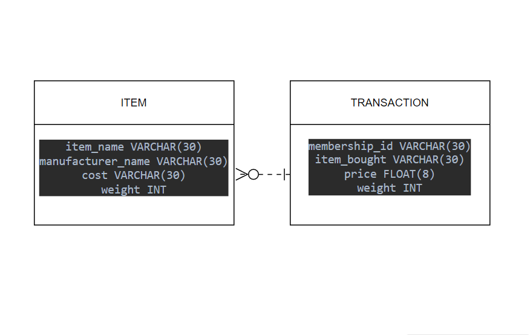

# **Items Table:**

## Description:

The Items table is a collection of all the products available for purchase on an online marketplace. Each item is uniquely identified by its Item ID. This table contains the following attributes:

### Columns:

Item Name: The name of the item

Manufacturer Name: The name of the manufacturer or brand that produces the item

Cost: The cost of the item in USD

Weight: The weight of the item in grams

#**Transactions Table:**

##Description:

The Transactions table is a record of all purchases made by customers on an online marketplace. Each transaction is uniquely identified by its Transaction ID. This table contains the following attributes:

###Columns:
Membership ID: The ID of the customer who made the purchase

Item_Bought: The item purchased

Purchase Price: The price paid for the item in USD

Weight: The weight of the items purchased in the transaction

###Queries:

Query to select top 10 membership IDs that spent the most money:

SELECT TOP 10 Membership_ID, SUM(Purchase_Price * Quantity) AS Total_Spent
FROM Transactions
GROUP BY Membership_ID
ORDER BY Total_Spent DESC;

This query will return the top 10 membership IDs that spent the most money on the online marketplace.

Query to find the top 3 items bought by all members:

SELECT TOP 3 Item_ID, SUM(Quantity) AS Total_Quantity
FROM Transactions
GROUP BY Item_ID
ORDER BY Total_Quantity DESC;

This query will return the top 3 items that were purchased the most by all members on the online marketplace.

ERD: 