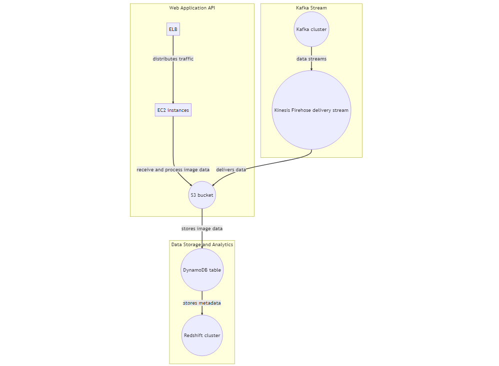

## Web Application API

The Web Application API is a component that receives image data from users who upload images through the API. This component is designed to be highly available and scalable by using Elastic Load Balancer (ELB) and Auto Scaling Group (ASG). The ELB distributes incoming traffic to a group of EC2 instances running the API code. The EC2 instances are hosted on an ASG, which automatically scales the number of instances up or down based on the traffic volume. This ensures that the API can handle a high volume of incoming requests and provides a good user experience.

## Kafka Stream

The Kafka Stream component is responsible for processing image data uploaded from a separate web application that streams data to the cloud. The Kafka brokers are hosted on EC2 instances within a separate VPC, which ensures that the Kafka cluster is isolated from other resources in the environment. The data streams are sent to a Kinesis Firehose delivery stream, which is responsible for delivering the data to the S3 bucket. The Firehose delivery stream is a managed service that is easy to set up and requires minimal configuration.

## Data Storage and Analytics

The Data Storage and Analytics component is responsible for storing the image data and metadata for 7 days and allowing analysts to perform analytical computations on the stored data. The S3 bucket stores the image data and metadata for 7 days before purging. This is achieved using a lifecycle policy to delete the data after 7 days. The metadata is stored in the DynamoDB table, which provides fast and scalable access to the data. DynamoDB is a NoSQL database that is designed to handle large volumes of data and provides low latency access to the data. The BI resource is a Redshift cluster that allows analysts to perform analytical computations on the stored data in S3 and DynamoDB. Redshift is a data warehousing solution that is designed to handle large volumes of data and allows analysts to run complex queries and perform data analysis.

## Assumptions

- The web application API and Kafka stream are separated and hosted in different regions or VPCs to ensure isolation and security.
- The image processing code is hosted on separate EC2 instances to ensure that it is scalable and highly available.
- The Kafka brokers are hosted on separate EC2 instances in a separate VPC to ensure that the Kafka cluster is isolated from other resources in the environment.
- The data is stored in S3 and the metadata in DynamoDB because S3 is designed to handle large volumes of data, while DynamoDB is designed to provide fast and scalable access to the data.
- Finally, the analysts can perform analytical computations on the stored data using Redshift, which is a data warehousing solution that provides scalability and allows complex queries and data analysis.
