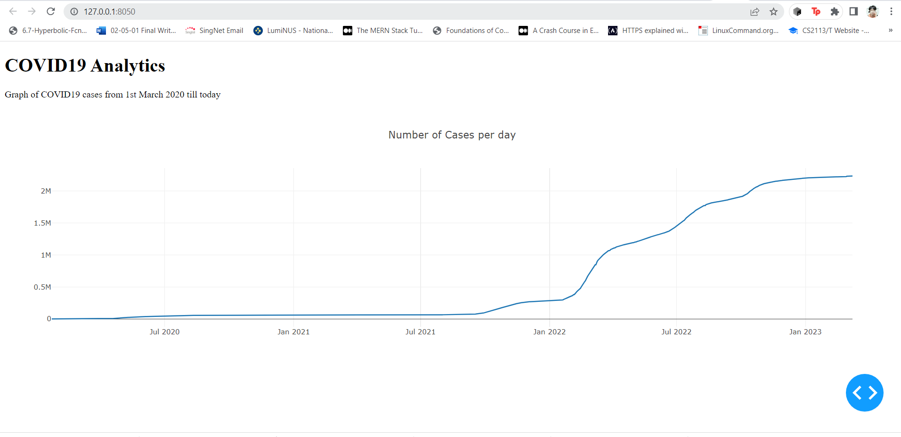

# Dash Application for Visualizing COVID19 Analytics

This program is a Dash application that visualizes COVID19 analytics for Singapore. It reads data from a public API, transforms it, and generates a graph showing the number of COVID19 cases per day from 1st March 2020 till today. The program includes three functions, `get_data()`, `generate_dashboard()`, and `convert_to_csv(data)`.

## `get_data()`

This function retrieves COVID-19 confirmed cases data for Singapore from a public API and returns it in JSON format. The API used is https://api.covid19api.com/country/singapore/status/confirmed/live?from=2020-03-01T00:00:00Z&to=. The function first gets the current date in the format yy-mm-dd using the `datetime.now()` function. It then concatenates this date with the API url to get data from 1st March 2020 till today. The function sends an HTTP GET request to the API and returns the response in JSON format.

## `generate_dashboard()`

This function creates a Dash application object for visualizing COVID19 analytics. It reads data from a CSV file named "data.csv", transforms it, and generates a graph showing the number of COVID19 cases per day from 1st March 2020 till today. The function first reads data from the CSV file using pandas. It then converts the "Date" column to a datetime format, sorts the data by "Date" column, and creates a Dash application object. The layout of the application is defined with a title, a paragraph, and a graph. The graph is configured with data and layout. The function returns the Dash application object.

## `convert_to_csv(data)`

This function takes a list of dictionaries as input and converts it to a CSV file named "data.csv". The function first opens a file named "data.csv" in write mode using the `open()` function. It then creates a CSV writer object using the `csv.writer()` function, specifying the delimiter as comma and quoting style as minimal. The function writes the headers (i.e., column names) to the CSV file using the first dictionary in the input list. It then iterates through the remaining dictionaries in the input list, extracts the values corresponding to the headers, and writes them to the CSV file.

The main driver code executes the program. It first calls the `get_data()` function to retrieve COVID19 data from an API and saves it in a CSV file using the `convert_to_csv(data)` function. Then it generates a dashboard to display the data using the `generate_dashboard()` function. Finally, it runs the dashboard server in debug mode using the `run_server()` method of the app object. The `if __name__ == '__main__':` statement ensures that this code block only runs if this script is executed as the main program.

Screenshot of dashboard:

